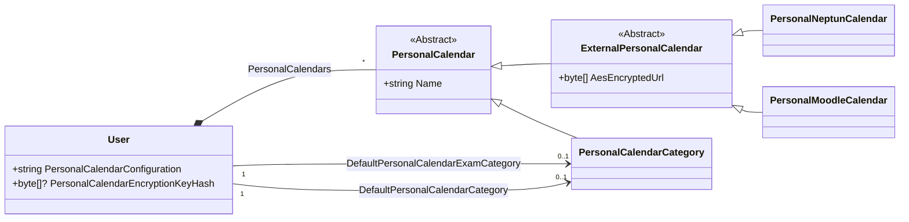

# StartSCH calendar editor

- Ragány-Németh Albert
- Önálló laboratórium
- Téma: Blazor alapú webes alkalmazás készítése

The [StartSCH calendar editor](https://start.sch.bme.hu/calendars/personal/edit)
is a feature of StartSCH that lets the user customize their Neptun and Moodle calendars
without having to give up automatic syncing of updates from Neptun and Moodle.

- Figma Slides presentation: https://www.figma.com/slides/lNVU1anuD0PAj3k932IyS6
- GitHub repository: https://github.com/kir-dev/StartSCH

The following link lists the commits made as part of this Project Laboratory:
https://github.com/kir-dev/StartSCH/compare/ba8e9368a0175aceac7c2b3743edc984366fe690...5d4c808632b8085ab433748e08d93855a0a2225d
- The last commit not included is `ba8e9368a0175aceac7c2b3743edc984366fe690`
- The last commit included is `5d4c808632b8085ab433748e08d93855a0a2225d`
- The "Fix WASM crash after prod updates" `9dfe4c870657432b2df1def1b1e0464abf143068` commit is not part
  of the Project Laboratory

```table-of-contents
title: ## Table of Contents
style: nestedList # TOC style (nestedList|nestedOrderedList|inlineFirstLevel)
minLevel: 2 # Include headings from the specified level
maxLevel: 0 # Include headings up to the specified level
include: 
exclude: 
includeLinks: true # Make headings clickable
hideWhenEmpty: false # Hide TOC if no headings are found
debugInConsole: false # Print debug info in Obsidian console
```

## The project

The calendar editor works by proxying requests to Neptun/Moodle from the user's calendar software
(like Google Calendar) and applying modifications to the calendars.

These modifications can be customized through the Blazor WebAssembly-based UI.

## User flows

This section outlines important flows the user goes through when using the editor and describes
some important user interface elements.

### Opening the editor

When a user opens the calendar editor (https://start.sch.bme.hu/calendars/personal/edit),
ASP.NET Core renders the `CalendarsPersonalEdit.razor` Blazor component.
This component is responsible for rendering the page and ensuring that the user's editor has been initialized.

The first time the user opens the editor page,
`CalendarsPersonalEdit.razor` creates the default categories,
generates a new AES encryption key and saves these to the database.
Then the user gets redirected to the same page,
but with a `token` query parameter set to the user's new editor token.

If a user has already used the editor but the browser URL does not include an editor `token`,
the app guides the user to open their Google Calendar for an editor link that does include a token.
As an alternative, the page also includes a form that can be used to clear encrypted data and
regenerate the user's encryption key.

### Adding external calendars to StartSCH

External calendars are calendars that StartSCH can request the user's personal events from.
Currently, StartSCH supports Neptun and Moodle calendars.

Before the user can use the editor, they have to add their external calendars:

After pressing the `+` button under Neptun or Moodle in the settings dialog,
another dialog opens that guides the user through creating an export URL in the given service.
This dialog contains suggestions linking to some known Neptun/Moodle
instances that get automatically hidden after the user has added them.

### Setting up syncing of StartSCH categories to a calendar client

The editor guides the user through copying the `.ics` URL of a category and adding it
to their Google Calendar. Additionally, as we can't automatically set the color
Google Calendar renders a given category in, the import flow also guides the
user through setting the category's color in Google Calendar manually.

The user can modify the color of the categories. When the user updates the color of
a category, it gets sent to the server and the calendar updates automatically.

### Modifying events

Once the user has added input calendars and set up exporting to Google Calendar, they can
start modifying events.

The main view of the editor shows the user's events in a calendar format. Clicking on an event
opens an `EventSettingsDialog`, which lists the event's details,
lets the user select the events they wish to modify, then shows modification options.

#### Event selection

The event selection options are dynamically computed, based on the selected event.
Currently, the user can select all events that
belong to the same *Neptun event series*. A Neptun event series contains events that
have the same subject name, course, and start at the same time every week.

#### Modification options

Available modification options also depend on the selected event. The `EventSettingsDialog` is
responsible for determining available options.

Once a user updates the value of an option, the `EventSettingsDialog` creates a `IModification`,
adds it to the `PersonalCalendarContext`, then sends the updated configuration to the server.

### Sync implementation

`https://start.sch.bme.hu/calendars/personal/67.ics?token=CfDJ8LZU_UcG29lE...`

The user adds a URL similar to the above to their Google Calendar. Sending a request to this URL
returns an iCalendar (`.ics`) file containing events, that after modification, are assigned to
the specified category.

The server first decodes the request token, uses the AES key in it to decrypt the user's external
calendar URLs, requests them, applies modifications, then returns the events in the requested category.

#### Output events

The events returned to Google Calendar contain additional details:
- A link to edit the given event in StartSCH.
- The subject's name for Moodle events. This is resolved using data from
  https://portal.vik.bme.hu/kepzes/targyak/ combined with the subject code
  returned by Moodle in the `.ics` file's `CATEGORIES` field.
  Subject data is retrieved every 24 hours by the `PortalVikBmeModule`.
- A link to open the given event in Moodle for Moodle events. This opens
  the Moodle calendar at the day the event starts, as there is no way to link to the
  actual underlying task for the event.

Additionally, we parse event titles and move certain details to the description, like the list of
teachers. Event parsing is done by `IcalendarCache` before caching the calendar.

## Architecture

StartSCH is a web app built with ASP.NET Core, Entity Framework Core, Blazor and Lit web components.
The calendar editor builds on these.

### Shared code

The calendar editor uses Blazor WebAssembly on the client-side and ASP.NET Core on the server-side.
This architecture allows us to share a significant portion of the business logic between
the frontend and the backend. For example, the same modification types that are used in the editor UI
are also used on the server when syncing data between Neptun/Moodle and Google Calendar.

Originally I wasn't sure that using WebAssembly is a good idea, as it takes a few seconds to
load when the user opens the editor, but not having too many dependencies appears to cut loading
times down enough where it's a worthwhile trade for better maintainability.

Source files (C# and Blazor) that are used on both the client and the server are found
in the `StartSch.Wasm/` directory.

### Database

StartSCH uses code-first Entity Framework Core. The calendar editor feature adds the following new
Entity Framework entities and properties to the database schema:



`PersonalCalendar`s represent the user's calendars,
including their external calendars (Neptun and Moodle)
and event categories (`PersonalCalendarCategory`).

The calendar editor feature uses the same database as StartSCH.
The `User` entity now has a list of `PersonalCalendar`s and the user's default calendar categories
are also persisted in the `User` table.

We use Entity Framework's table-per-hierarchy mapping method for `PersonalCalendar`s,
meaning all `PersonalCalendar` inheritors are stored in the same database table.
Concrete types are differentiated using a `string Discriminator` column and properties
that only exist on certain types are set to `null` for types that do not have them.

TPH mapping allows us to query all calendars owned by a given user in a single query.
Then we can just use the runtime type of the object returned by Entity Framework as it handles
deserializing to the correct type.

`User.PersonalCalendarConfiguration` stores the user's
configuration (`PersonalCalendarConfigurationDto`) serialized to JSON.
This configuration currently only contains a list of `Modification`s:

### Modifications

`Modification`s represent automatically applied modifications to a user's events.

`Modification`s are made up of a target (`IModificationTarget`) that specifies which events a given 
modification applies to, and an action (`IModificationAction`), that given an event,
applies the modification.

`IModificationTarget`s support removing a targeted event using the
`bool RemoveTarget(EventContext eventContext)` method. When this method returns `true`,
the modification has to be garbage collected as it no longer has any targets left.

`IModificationTarget`s use indexes defined on the `EventIndex` to find their targets.
Maintaining these indexes is the responsibility of the `EventIndex`, modification targets
are just a consumer.

Both `IModificationAction`s and `IModificationTarget`s use polymorphic JSON serialization.
This means that when we JSON-serialize, for example, a `IModificationAction`, it receives a
`$type` field with the type's name.
When deserializing, the `JsonSerializer` figures out the runtime type by reading
the `[JsonDerivedType(Type, Name)]` attributes on `IModificationAction`.

### `PersonalCalendarContext`

The root model for the calendar editor, used by client-side editor UI and the server when applying
modifications.

Gets constructed for the user's calendars already filled out with events and the user's
calendar configuration, including modifications. After deserializing the configuration,
the `PersonalCalendarContext` stores a list of calendars with events
and modification and indexes them.

These indexes are updated when the user modifies events in the UI.
A subset of these indexes make up the `EventIndex` used by modifications.

Each event can only have one modification per modification action,
it is the `PersonalCalendarContext`'s responsibility to uphold this rule.

### `EventContext`

Most indexes store references to `EventContext`s. These have a reference to the original, unmodified
event and a list of modifications that apply to the given event. Any time the modification list changes,
the `EventContext` creates a copy of the original event, applies the modificaitions one-by-one and
caches the modified event.

## Security

As having access to a user's Neptun and Moodle export URLs can allow an attacker
to retrieve the contents of a user's calendars, we store these URLs in a way where even
if the StartSCH database gets leaked, the attacker does not gain access to these URLs.

The current system uses two layers of encryption: external URLs are stored in the database
encrypted using the user's AES encryption key. This AES key is then encrypted using
ASP.NET Core Data Protection, before being handed to the user.

Data Protection keys are stored in the StartSCH database.

A SHA256 hash of the user's AES key is stored in the database to validate tokens in
`User.PersonalCalendarEncryptionKeyHash`.

### Encryption tokens

There are two very similar tokens that are used to transport the user's AES encryption token:
- `PersonalCalendarCategoryRequestToken(AesKey, CategoryId)`: these are included in the URLs that the user adds to their Google Calendar.
  They, in addition to the user's AES key, contain the ID of a calendar category
  and authorize access to it.
- `PersonalCalendarEditorToken(AesKey, UserId)`: these are used to pass the encryption key to the server when
  using the editor UI. These are included in the page's URL when the user first opens the editor,
  and these are returned in the `.ics` in the "Modify event" link in every event's description.
  To use these, the user has to be authenticated with the user specified in the token.
  The server validates this before returning a response.

These both have a class that is responsible for serializing the AES key and the user/category ID
in a space-efficient manner, so that the resulting tokens, and in turn, the links are as small
as possible. Space efficiency is a must, as Google Calendar only allows calendars up to 1 MB.

Additionally, these classes also ensure that tokens are encrypted using ASP.NET Data Protection.

### Authentication

The editor uses the already existing authentication system of StartSCH that uses
OpenID Connect with [AuthSCH](https://auth.sch.bme.hu) as the identity provider.

Configuration for this is in `StartSch/Program.cs`.

## UI components, CSS

The editor also uses the same UI system as StartSCH: Blazor and Lit components with common CSS code
stored in global `.css` files and component-specific CSS in in-line styles attributes or using
Lit's/Blazor's scoped CSS features.

StartSCH uses Google's `material-web` Lit components. These are either consumed
in Blazor as normal HTML elements (e.g. `<md-filled-button>`) or
wrapped in Blazor components when there are issues that need a workaround.
These components are stored in `StartSch.Wasm/Components/` and are prefixed with `Md`.

### Calendar UI component

The calendar uses the `full-calendar` JavaScript library wrapped in a
Lit component (`calendar-view.ts`) for rendering the calendar.

Every time the editor rerenders or the user updates the visible range in the calendar,
the C# code finds all visible events, serializes them to JSON then passes them
to the `<calendar-view>`. The Lit component then passes these to Full Calendar.

The `<calendar-view>` element fires DOM events when the user clicks an event (`calendareventclicked`)
or the visible range changes (`calendarrangechanged`).
These are translated to Blazor using `EventHandler`s defined in `StartSch.Wasm/EventHandlers.cs`
and `StartSch/wwwroot/StartSch.lib.module.js`.

## Summary

This project has been deployed to https://start.sch.bme.hu, and it has already made
my calendar significantly more usable. I can now hide events that I don't want to see,
add information to events, and categorize events based on importance.
