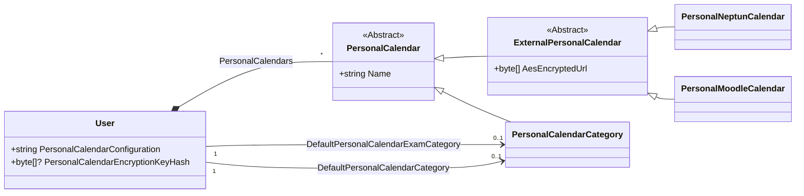

# StartSCH calendar editor

The [StartSCH calendar editor](https://start.sch.bme.hu/calendars/personal/edit)
is a feature of StartSCH that lets the user customize their Neptun and Moodle calendars
without having to give up automatic syncing of updates from Neptun and Moodle.

## Architecture

### Shared code

The calendar editor uses Blazor WebAssembly on the client-side and ASP.NET Core on the server-side.
This architecture allows us to share a significant portion of the business logic between
the frontend and the backend. For example, the same modification types that are used in the editor UI
are also used on the server when syncing data between Neptun/Moodle and Google Calendar.

Originally I wasn't sure that using WebAssembly is a good idea, as it takes a few seconds to
load when the user opens the editor. Not having too many dependencies appears to cut loading
times down enough where it's a worthwhile trade for better maintainability.

Source files (C# and Blazor) that are used on both the client and the server are found
in the `StartSch.Wasm/` directory.

### Database

The calendar editor feature uses the following new Entity Framework entities and properties:

`PersonalCalendar`s represent the user's calendars,
including their external calendars (Neptun and Moodle)
and event categories (`PersonalCalendarCategory`).

The calendar editor feature uses the same database as StartSCH.
The `User` entity now has a list `PersonalCalendar`s and the user's default calendar categories
are also persisted in the `User` table.

We use Entity Framework's table-per-hierarchy mapping method for `PersonalCalendar`s,
meaning all `PersonalCalendar` inheritors are stored in the same database table.
Concrete types are differentiated using a `string Discriminator` column and properties
that only exist on certain types are set to `null` for types that do not have them.

TPH mapping allows us to query all calendars owned by a given user in a single query.
Then we can just use the runtime type of the object returned by Entity Framework as it handles
deserializing to the correct type.

`User.PersonalCalendarConfiguration` stores the user's
configuration (`PersonalCalendarConfigurationDto`) serialized to JSON.
This configuration currently only contains a list of `Modification`s:

### Modifications

`Modification`s represent automatically applied modifications to a user's events.

`Modification`s are made up of a target (`IModificationTarget`) that specifies which events a given 
modification applies to, and an action (`IModificationAction`), that given an event,
applies the modification.

`IModificationTarget`s support removing a targeted event using the
`bool RemoveTarget(EventContext eventContext)` method. When this method returns `true`,
the modification has to be garbage collected as it no longer has any targets left.

`IModificationTarget`s use indexes defined on the `EventIndex` to find their targets.
Maintaining these indexes is the responsibility of the `EventIndex`, modification targets
are just a consumer.

### `EventContext`

Most indexes store references to `EventContext`s. These have a reference to the original, unmodified
event and a list of modifications that apply to the given event. Any time the modification list changes,
the `EventContext` creates a copy of the original event, applies the modificaitions one-by-one and
caches the modified event.

### `PersonalCalendarContext`

Contains the user's calendars

## Security

As having access to a user's Neptun and Moodle export URLs can allow an attacker
to retrieve the contents of a user's calendars, we store these URLs in a way where even
if the StartSCH database gets leaked, the attacker does not gain access to these URLs.

The current system uses two layers of encryption: external URLs are stored in the database
encrypted using the user's AES encryption key. This AES key is then encrypted using
ASP.NET Core Data Protection, before being handed to the user.

A SHA256 hash of the user's AES key is stored in the database to validate tokens in
`User.PersonalCalendarEncryptionKeyHash`.

---

Each event can only have one modification per modification action, it is the `PersonalCalendarIndex`'s
responsibility to uphold this rule.

Additionally, `PersonalCalendarIndex` contains editor source data:
calendars (indexed by ID), modifications, and a few user-specific configurations
(currently the default category for events with no category set and the default category for exams).
